# MiniProject-Function

## The overall gpal of this project is to develope a shell script for one DataWyse solution client's, that automate the setup of EC2 instance and S3 buckets. Part of the critical elements we will be focusing on in this project is function.

## Function

## Organizing your code is key to maintaining clarity and efficiency. One powerful technique for achieving this is through the use of function.

## A function is like a reusable block of code that you can define once and run (or call) whenever you need it.

## A function is like a reusable block of code that you can define once and run (or call) whenever you need it.

### It helps you:

-Avoid repetition

- Organize your code

- Make scripts cleaner and easier to manage

## Lets consider the following logic and encapsulate them in function.

- Check if script has an argument

- Check if AWS CLI is installed

- Check if environment variables exist to authenticate to AWS

# To create a function in a script, you simply have to define it using the following syntax.

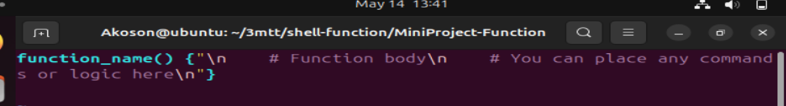

## Breakdown

## function_name():
### This defines the name of your function. You can name it anything (e.g., greet_user, create_folder). The () just tells the shell this is a function.

## Syntax	Explanation
function_name()	This defines the name of your function. You can name it anything (e.g., greet_user, create_folder). The () just tells the shell this is a function.

## {:
### This opens the function body—where your logic or commands go. Think of it like opening a container.

## Function body:
### This is a comment. It explains what's happening but doesn’t run. It's helpful for understanding the code.

## # You can place...
### Another comment. It reminds you that inside this block, you can write any commands or logic (like echo, if, for, etc.).

## }:
### This closes the function. It's like saying "I'm done writing what this function should do."

## \n:
### New line (line break). \n is called a newline character.It tells the shell (or any programming language) to start a new line when printing or formatting text.

## echo -e
### Enables interpretation of escape characters like \n, \t (tab), etc.

# Function: Check if script has argument
## A code without a function

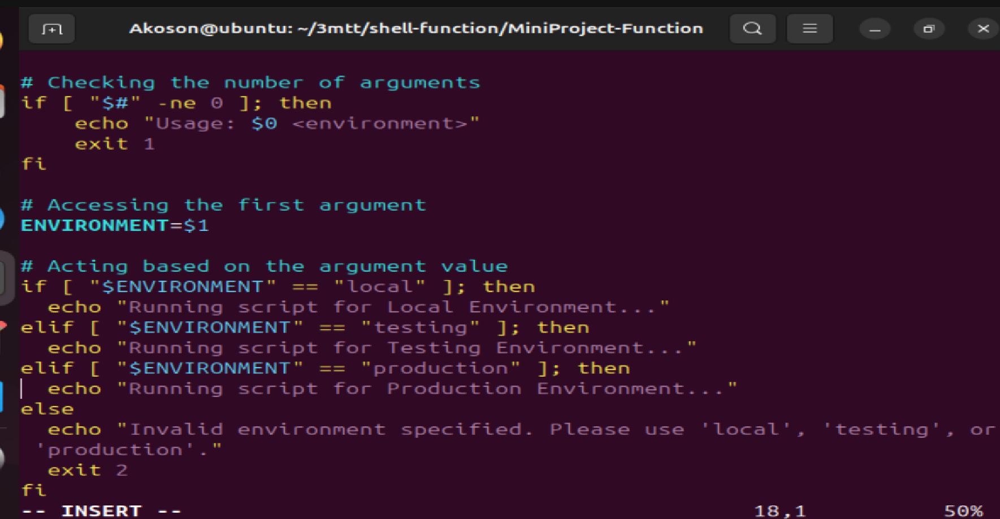

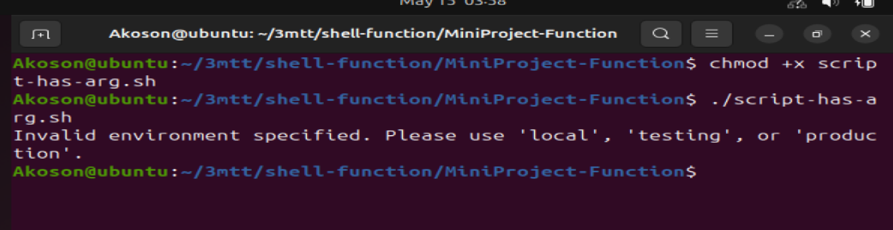

## It will look like this with a function call check_num_of_arg

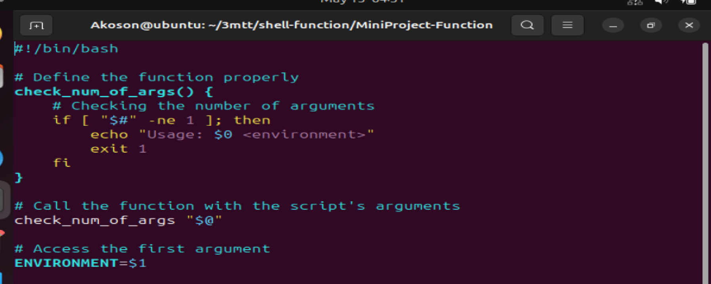

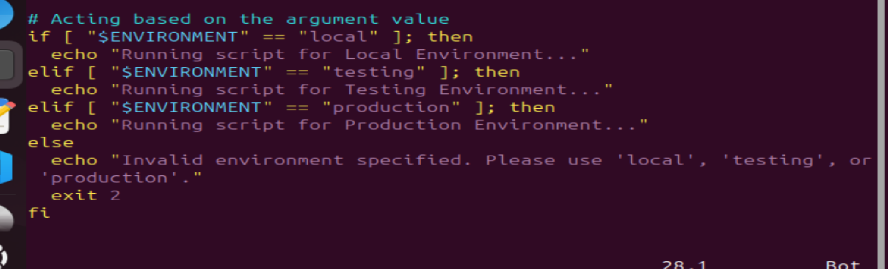

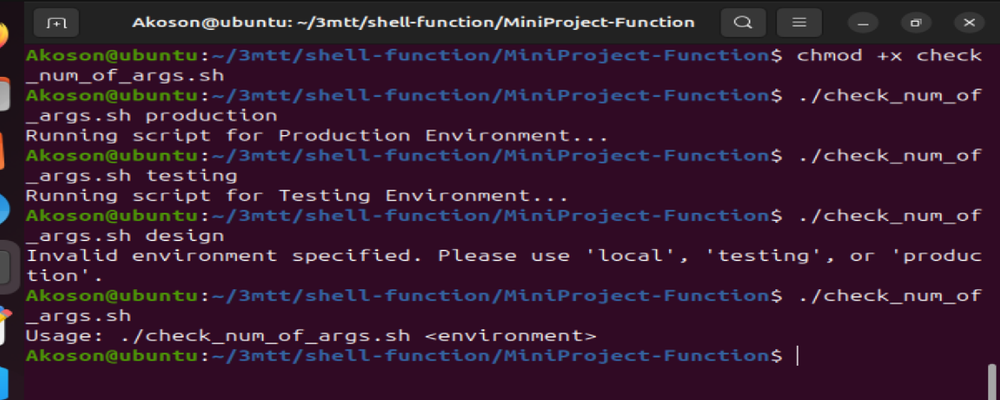

# The output of the script depends on the argument you provide when running it. Let’s walk through each possible case: 

##  When you provide one valid argument (local, testing, or production):

## command: ./check_num_of_args.sh local

## Output: Running script for Local Environment...

## When you provide an invalid argument (e.g. staging)

## command: ./check_num_of_args.sh staging

## Output: Invalid environment specified. Please use 'local', 'testing', or 'production'.

##  When you provide no argument:

## command: ./check_num_of_args.sh

## Output: Usage: ./check_num_of_args.sh <environment>

## When a function is defined in a shell script, it remains inactive until it is involved or called within the script. To execute the code within the function, you must place a call to the function in a relevant part of your script.

## Its crucial to consider the order in which the interpreter evaluates each line of code. Placing the function where it logically fits within the flow of your script ensures that it is available and ready to be executed when need. This organization helps maintain the readability and coherence of your script, making it easier to understand and debug.

## This is what it would look like:

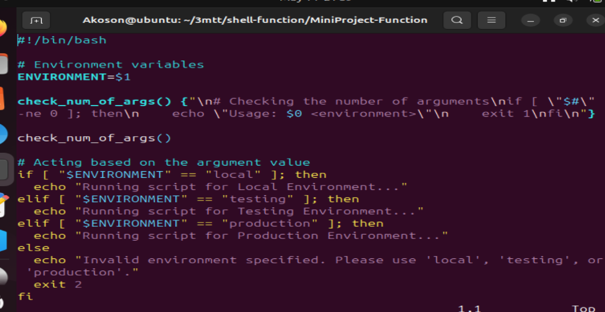

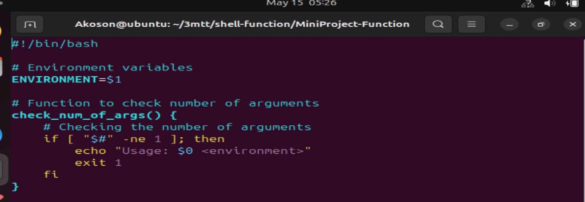

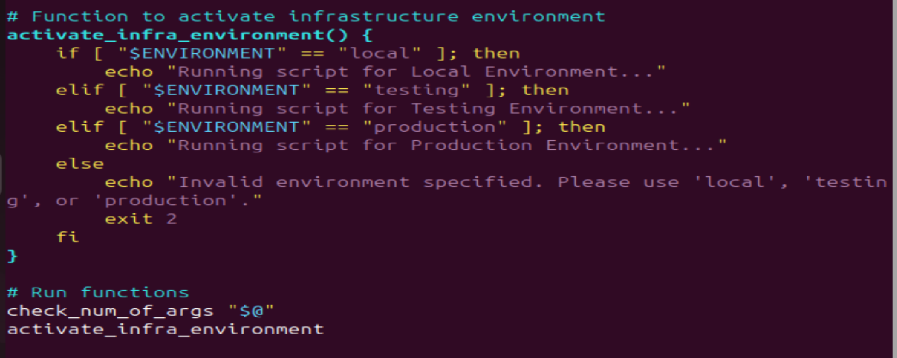

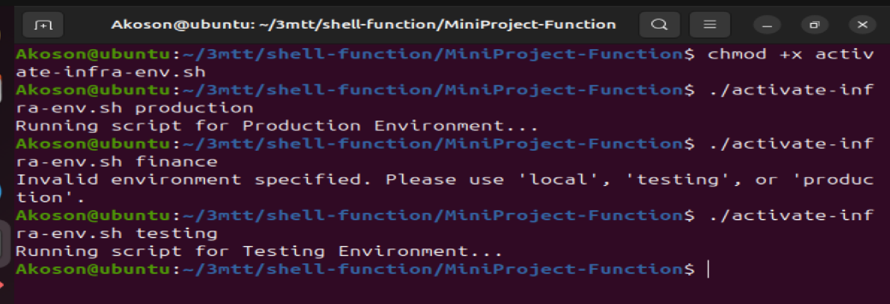

## With a refactored version of the code, we now have the flow like this:

- Environment variable move to the top

- Function defined

- Function call

- Activate base on infrastructure environment section.

## What WE COULD also do is encapsulate number 4 in a function and call all the functions at the end of the script. This is what you would see most times in the real world.

# This is what the script would look like:

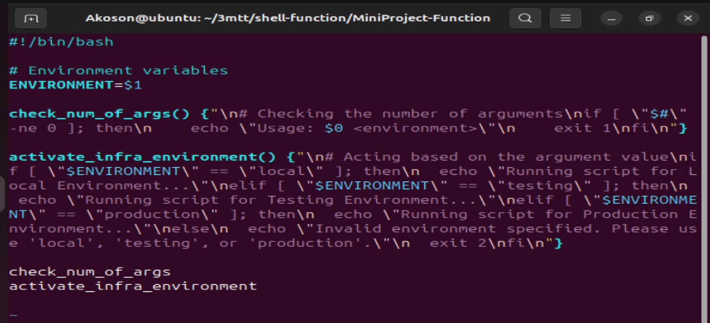

## With the updated version of the code, you can now see how clean the code looks. You can easily understand what each function is doing base on its name, comments, and the order in which the functions are called at the end.

# Check if AWS CLI is installed

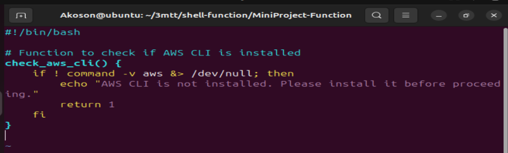

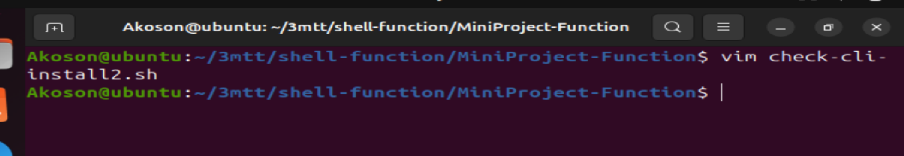

## The output of the script depends on whether the AWS CLI is installed on your system.

## Because the condition if ! command -v aws &> /dev/null is false, the function does nothing and silently exits.

## Lets break down this section of the code

## if! command -v aws &>/dev/null;then; This line contains an if statement. Here"s the breakdown:

## !: This is the logical negation operator. It reverses the result of a command, so ! command means "if Not"

## command -v aws: This command checks if the aws command is available in the system. It returns the path to the aws executable if it exists, or nothing if it doesnt. If you run this on your system, it will tell you the path to the 'aws' cli that you installed previously.

## "which aws"

## Hence, the "command -v" utility also returns the same thing that the "which" command returns. With the "!" operator, we are saying that if the path for "aws" does not exist, then return 1.

## &/dev/dull: This redirects both standard output (stout) and standard error (aterr) to /dev/null. a special device file that dscard all output. This effectively suppresses any output from the command -v command.

## then: This keywaord indicates the begining of the code block to execute if the condition in the statement is true.

## echo "AWS CLI is not installed. Please install it before proceeding." This line prints error message to the standard output if the AWS CLI is not installed.

## return 1: This line causes the function to exit with a non-zero exit status (1). A non - zero exit status conventionally indicates an error condition in unix-like-systems.

# Check if environment variable exists to authnticate to AWS.

## To programmatically create resources in AWS, you need to configue authentification using various means such as environment variables, configuration files, or IAM roles.

## The ~/.aws/credential and ~/.aws/config files are commonly used to store AWS credentials and configuration settings, respectively.

## Running the "aws configure command" we ran earlier creates these files. You can use the cat command to open them and see the content.

# credential File (~/.aws/credentials)

## The credential file typically contains AWS access key ID and secret access key pair. you will have only default section at first. But you can add other environmentals as requied. Just as we have for testing and productio.

## it is formatd as follows

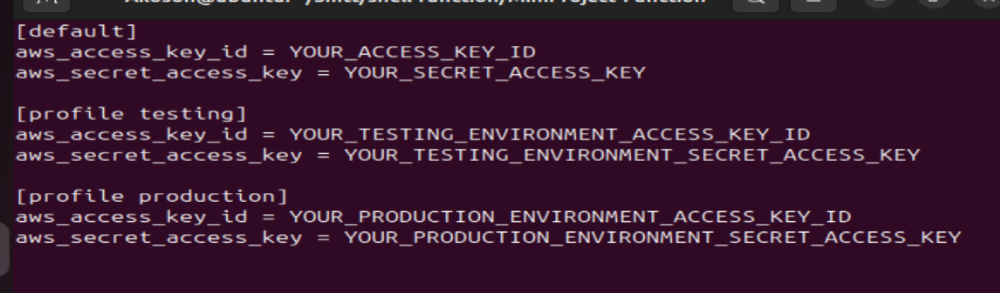

# config file (~/.aws/config)

## The config file stores configuration settings for AWS services and clients. It can include settings such as the default region, output format, and profiles. An example config file might look like this: 

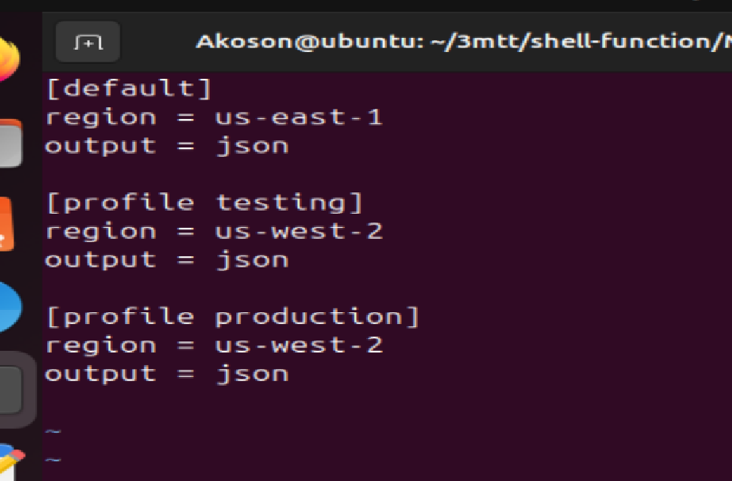

## A profile will enable you to easily switch between different AWS configurations. If you set an environment variable b running the command "export AWS_PROFILE=testing" this will pick up the configuration from both file and authenticate you to the testing environment.

# AWS profile
## The AWS_PROFILE environment variables allows users to specify which profile to use from their AWS config and credentials files. If AWS_PROFILE is not set, the default profile is used.

## Here is what the function would look like:

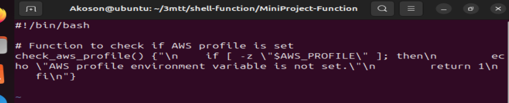

## If you run the script and the AWS_PROFILE environment variable is not set, the output will be:

## If AWS_PROFILE is set, the function will produce no output and exit silently with a success status (0).

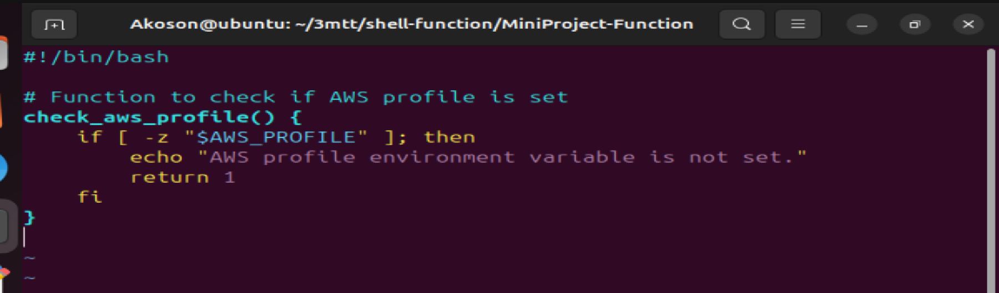

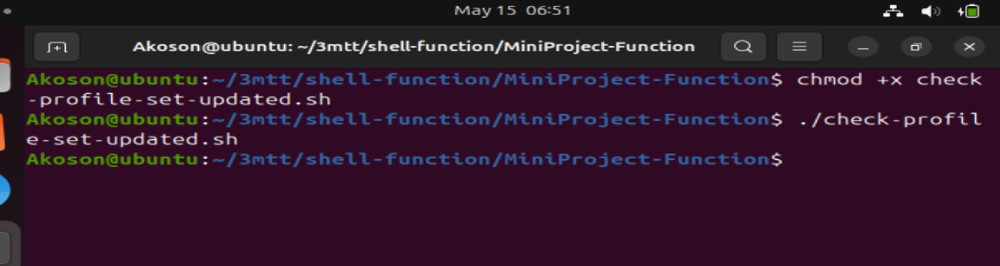

## The -z flag is used to test if the value of the string variable (in this case, the value stored in the $AWS_PROFILE variable) has zeo length, meaning it is empty or null.

## Our shell script will now look like this:

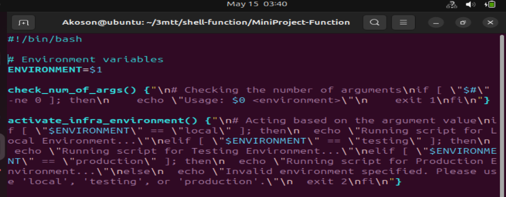

## This is the update working script

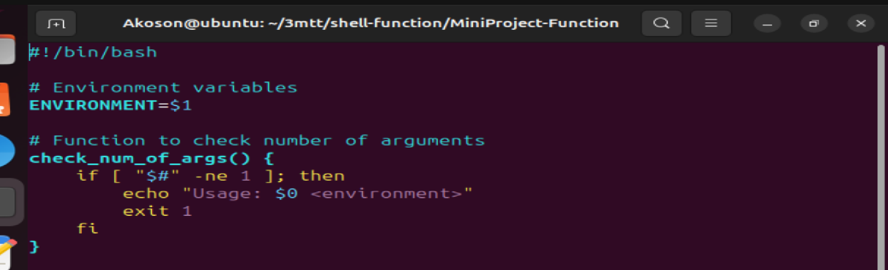

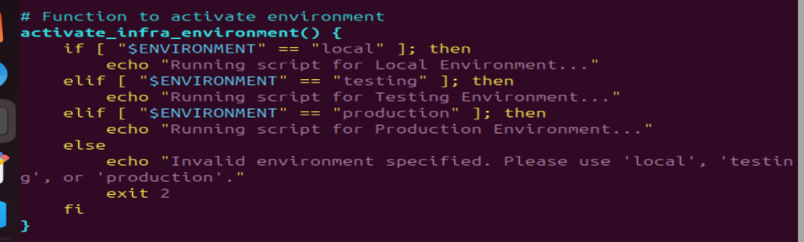

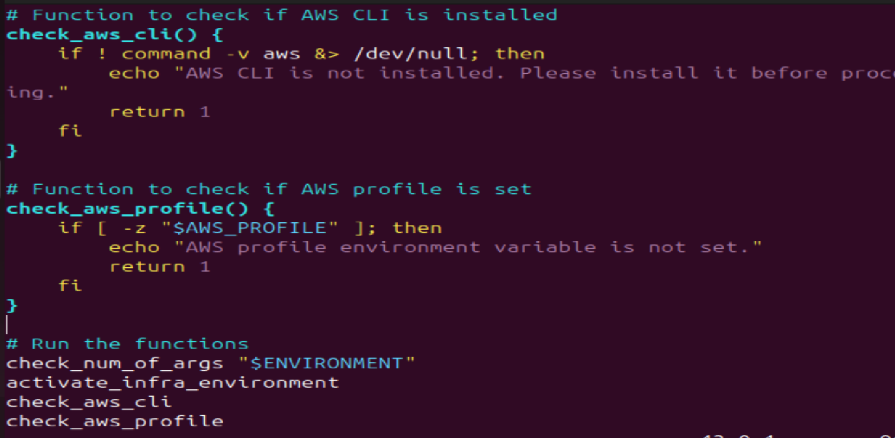

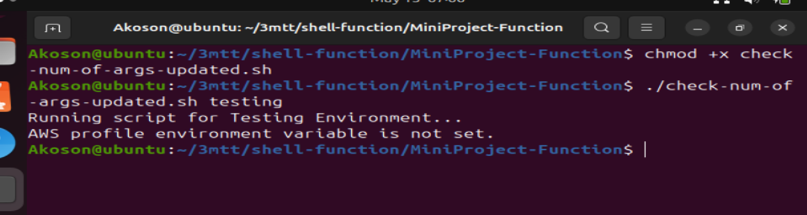

## The output of your corrected script will depend on:

- Whether an argument was passed

- What the argument value is

- Whether AWS CLI is installed

- Whether the AWS_PROFILE environment variable is set

## If you run it without an argument:

### $ ./your_script.sh

## Output: Usage: ./your_script.sh <environment>

## If you pass an invalid environment value:

### $ ./your_script.sh dev

## Output: Invalid environment specified. Please use 'local', 'testing', or 'production'.

##  If you pass a valid environment but AWS CLI is not installed:

### $ ./your_script.sh local

## Output: Running script for Local Environment...
## AWS CLI is not installed. Please install it before proceeding.

##  If everything is set up correctly:
- AWS CLI is installed

- AWS_PROFILE is set

- Argument is valid (local, testing, or production)

### $ export AWS_PROFILE=my-aws-profile
### $ ./your_script.sh production

## Output: Running script for Production Environment...

